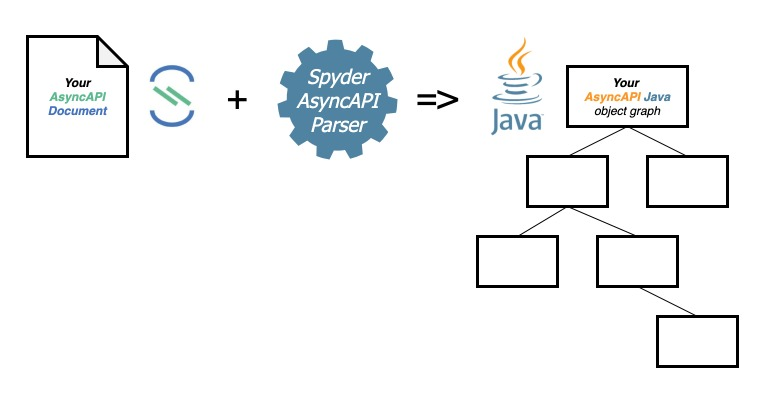

# Spyder AsyncAPI Parser
Generate a Java Object Graph representation of your AsyncAPI 2.0.0 base API document.

## About
Spyder AsyncAPI Parser is a Java based AsyncAPI parser. 
You can use it to generate a Java object graph representation of your AsyncAPI 2.0.0 base API document.

How you use your generated Java object graph is up to you (and your creativity 🙂).



```diff
+ Please note this is a rapidly evolving alpha.
+ During this phase, you can stabilise a copy by taking a clone from github.
+ It will be versioned as beta very soon (probably by the end of March 2021).
+ The beta will be made available on maven central.
```


## Prerequisites
You need the following prerequisites installed locally:
* java (1.8 or above)
* git
* gradle
* maven

## Installation
```bash
# To clone a local copy of the code ...
mkdir ~/your-folder
cd ~/your-folder
git clone https://github.com/JohnRCatlin/spyder-asyncapi-parser.git

# To build locally ...
cd ~/your-folder/spyder-asyncapi-parser
gradle build

# To install to your local maven repository …
cd ~/your-folder/spyder-asyncapi-parser
gradle publishToMavenLocal
open ~/.m2/repository/engineer/asyncapi/spyder.parser

# To install the javadoc …
cd ~/your-folder/spyder-asyncapi-parser
gradle javadoc
open ./docs/javadoc/index.html
```

## Usage
### Project Dependency 
Following a local install (see above), you can configure a dependency in your project's Maven or Gradle configuation.

Using maven ...
```xml
<dependency>
  <groupId>engineer.asyncapi'</groupId>
  <artifactId>spyder.parser</artifactId>
  <version>1.0.alpha-SNAPSHOT</version>
</dependency>
```

Using gradle ...
```gradle
compile group: 'engineer.asyncapi', name: 'spyder.parser', version: '1.0.alpha-SNAPSHOT'    
```

### Example 1
Parse from a URL.

```java
final String source = "https://raw.githubusercontent.com/JohnRCatlin/asyncapi-recipes/main/src/fabrics/fabrics.amqp.yml"; 

final AsyncAPIParser parser = AsyncAPIParserFactory.create(SupportedAsyncAPIVersions.V2_0_0);
final AsyncAPI root = parser.parseFromUrl(source);

assert root.getAsyncapi().equals(SupportedAsyncAPIVersions.V2_0_0.value);
```

### Example 2
Parse from a file location.
```java
final String source = new File("").getAbsolutePath() + "/src/test/resources/streetlights2.yml";

final AsyncAPIParser parser = AsyncAPIParserFactory.create(SupportedAsyncAPIVersions.V2_0_0);
final AsyncAPI root = parser.parseFromFile(source);

assert root.getAsyncapi().equals(SupportedAsyncAPIVersions.V2_0_0.value);
```

### Example 3
Parse from a string.

```java
final StringBuilder sb = new StringBuilder();
sb.append("asyncapi: '2.0.0'\n");
sb.append("info:\n");
sb.append("  title: Streetlights API\n");
sb.append("  version: '1.0.0'\n");
sb.append("  description: |\n");
sb.append("    The Smartylighting Streetlights API...\n");
sb.append("  license:\n");
sb.append("    name: Apache 2.0\n");
sb.append("    url: https://www.apache.org/licenses/LICENSE-2.0\n");
final String source = sb.toString();

final AsyncAPIParser parser = AsyncAPIParserFactory.create(SupportedAsyncAPIVersions.V2_0_0);
final AsyncAPI root = parser.parseFromString(source);

assert root.getAsyncapi().equals(SupportedAsyncAPIVersions.V2_0_0.value);
assert root.getInfo().getTitle().equals("Streetlights API");
assert root.getInfo().getLicense().getName().equals("Apache 2.0");
```

## Javadoc
You can find the javadoc [here](https://johnrcatlin.github.io/spyder-asyncapi-parser/javadoc/).

## Notes
Please note. This is not an AsyncAPI validator. It's only a parser. This is a deliberate design decision (not an oversight).

It will attempt to parse any well formed yaml as an AsyncAPI. It will parse what it recognises and skip what it doesn't. The yaml MUST have an `asyncapi: '2.0.0'` field. It MUST be well formed (syntactically corrrect) yaml.

## Licence
This is an open source project using an [Apache 2.0](https://github.com/JohnRCatlin/spyder-asyncapi-parser/blob/master/LICENSE) licence.

## Bugs and Features
Sometimes bugs exist (this happens). 
Sometimes we need new features. 
In both cases, please feel welcome to contribute, and/or raise bugs, issues or requests [here](https://github.com/JohnRCatlin/spyder-asyncapi-parser).

## Contributions
Please feel welcome to contribute on [Github](https://github.com/JohnRCatlin/spyder-asyncapi-parser).
